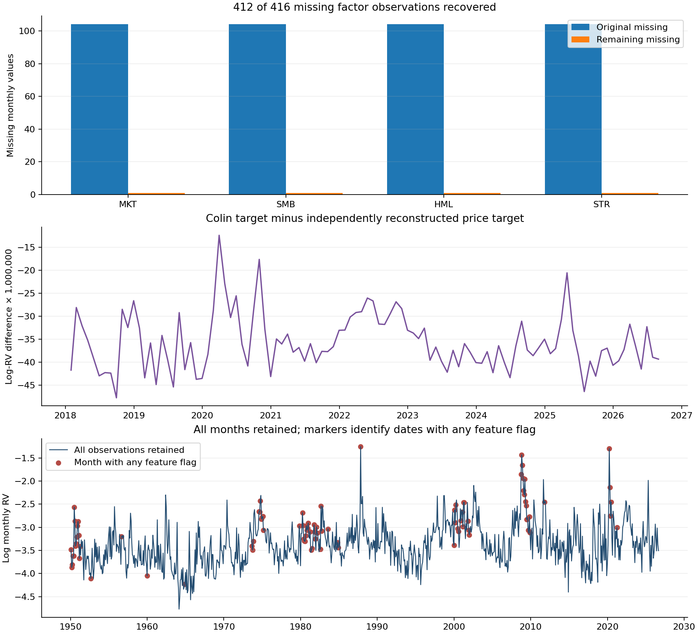
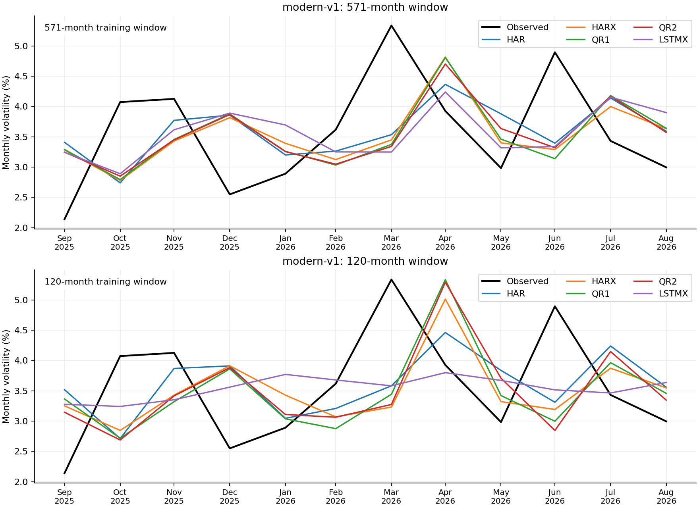

# Colin dataset testing — September 24, 2026

The new data are integrated and tested on the **Vikas** branch of aidanccc/qrc-volatility-research. Original inputs and historical outputs are preserved. This report separates the paper-feature reconstruction from the modern price-feature experiment.

On Colin’s data, the lowest final-year MSE is HARX with the 120-month window (0.06384); HARX with the 571-month window (0.06385). Over the full 104-month evaluation: AR1 with 120 months (0.18236); HARX with 571 months (0.17110). The confidence sets retain multiple classical and quantum models; these results do not establish unique quantum superiority.

## Data findings

The input contains 920 monthly observations through August 2026. Of 416 missing factor cells, **412 were recovered**; four August values remain unavailable. The prepared copy corrects **211 derived-feature inconsistencies**. **138 statistical flags** were retained for review without deleting observations.

The 1950–2017 overlap matches the original dataset to floating-point precision. Official FIZ archives verified factor scales before the extension was filled. FIZ observations through 2024 transition to CIZ in 2025. Colin supplied no generation script or scaling metadata; retrospective macro availability and exact extension normalization remain unverified.

Colin and independently rebuilt modern log-RV targets differ by up to 0.00004776 after 2017. Results below are evaluated against each protocol's own target; their MSE levels must not be treated as a controlled head-to-head test of feature sets.

## Forecast results

| protocol | period | window | lowest_MSE_model | MSE | RMSE | HAR_MSE | QR1_MSE | QR2_MSE |
| --- | --- | --- | --- | --- | --- | --- | --- | --- |
| Colin paper features | last12 | 120 | HARX | 0.0638399 | 0.252666 | 0.0901862 | 0.104454 | 0.123361 |
| Colin paper features | last12 | 571 | HARX | 0.0638506 | 0.252687 | 0.0855129 | 0.0827546 | 0.072715 |
| Colin paper features | post2017 | 120 | AR1 | 0.182363 | 0.427039 | 0.192469 | 0.217209 | 0.23498 |
| Colin paper features | post2017 | 571 | HARX | 0.1711 | 0.413642 | 0.187131 | 0.180212 | 0.173687 |
| Modern price features | last12 | 120 | LSTMX | 0.0676978 | 0.260188 | 0.0901843 | 0.103713 | 0.111472 |
| Modern price features | last12 | 571 | HAR | 0.0855105 | 0.292422 | 0.0855105 | 0.0942386 | 0.0889074 |
| Modern price features | post2017 | 120 | AR1 | 0.18236 | 0.427036 | 0.192466 | 0.18587 | 0.216499 |
| Modern price features | post2017 | 571 | CRLX | 0.170985 | 0.413503 | 0.187128 | 0.171392 | 0.17602 |

Both windows are reported without selecting one after seeing outcomes. Full-period results cover January 2018–August 2026; last12 covers September 2025–August 2026. Lower MSE is a ranking, not proof of superiority.

| protocol | expected_records | successful_scored | failed_scored | unavailable_scored | successful_unscored | unavailable_unscored |
| --- | --- | --- | --- | --- | --- | --- |
| Colin paper features | 7560 | 7486 | 2 | 0 | 28 | 44 |
| Modern price features | 7560 | 7486 | 2 | 0 | 72 | 0 |

August can be scored using July factors. Missing August inputs make dependent September forecasts unavailable; September has no observed target. Numerical fit failures are retained and excluded from complete-model rankings, with additional all-model common-date comparisons.

## Statistical evidence

- Colin, 120-month window, mse_log_rv: 95% Model Confidence Set retains LSTMX, QR2, LSTM, CRLX, Persistence, HARX, AR3, CRL, HAR, QR1, AR1.
- Colin, 120-month window, qlike_variance: 95% Model Confidence Set retains CRLX, LSTMX, LSTM, AR3, CRL, HARX, HAR, QR2, QR1, AR1, Persistence.
- Colin, 571-month window, mse_log_rv: 95% Model Confidence Set retains LSTM, HAR, AR3, CRL, CRLX, QR1, AR1, QR2, HARX.
- Colin, 571-month window, qlike_variance: 95% Model Confidence Set retains LSTMX, AR3, CRL, HAR, LSTM, Persistence, HARX, CRLX, QR1, QR2, AR1.
- Modern, 120-month window, mse_log_rv: 95% Model Confidence Set retains QR2, CRLX, LSTM, Persistence, LSTMX, AR3, CRL, HAR, ARMAX, HARX, QR1, AR1.
- Modern, 120-month window, qlike_variance: 95% Model Confidence Set retains QR2, CRLX, LSTMX, LSTM, AR3, CRL, HAR, Persistence, AR1, QR1, HARX, ARMAX.
- Modern, 571-month window, mse_log_rv: 95% Model Confidence Set retains LSTM, HAR, AR3, CRL, QR2, LSTMX, HARX, AR1, QR1, CRLX.
- Modern, 571-month window, qlike_variance: 95% Model Confidence Set retains LSTM, LSTMX, AR3, Persistence, CRL, HAR, QR2, HARX, CRLX, QR1, AR1.

MCS uses 10,000 stationary-bootstrap replications with six-month expected blocks. Each report also contains paired HAR loss-difference intervals, seed-level metrics and common-date comparisons. Seeds are repeated model realizations, not additional market histories.

## Plots

### Colin paper features

### Modern price features

## Additional tests and interpretation

The original legacy notebook pipeline was rerun independently. Quantum maximum absolute discrepancies against the supplied author CSV: QR2=1.08e-06, QR1=1.2e-06. This verifies faithful reconstruction to the previously observed numerical tolerance, not access to unpublished code.

Exploratory matched-ridge diagnostics use each reservoir’s same three-step raw inputs, training-only standardization, and a penalty selected using 24 strictly preceding forecast errors. They score the same 80 months beginning January 2020. Conditioning, paired block-bootstrap intervals and descriptive outlier slices are recorded separately. They do not replace the primary benchmark.

## Read and reproduce

- [Colin report](../colin-2026-09-24/report.md)
- [Modern report](../modern-2026-09-24/report.md)
- [Colin exploration](../colin-exploratory-2026-09-24/report.md)
- [Modern exploration](../modern-exploratory-2026-09-24/report.md)
- [Data audit](../../docs-colin/AUDIT.md)
- [Run order](../../RUN_ORDER.md)

Data-source hashes, correction ledgers, complete commit inventories, test evidence, run identities, per-origin forecast records and reproduction commands accompany the results. Quantum results are ideal local simulations and make no hardware-speedup or trading-profit claim.

### Exploratory finding

On the same 80 months, the Colin 571-month QR2 input-matched raw ridge has MSE 0.13262 versus 0.13925 for the quantum features with matched ridge. The six-month-block confidence interval for quantum minus raw loss is approximately [-0.01385, 0.03010]. This does not establish a reservoir advantage; it motivates keeping simple input-matched baselines in future studies. These are exploratory results, separate from the 104-month headline evaluation.
