# Plots

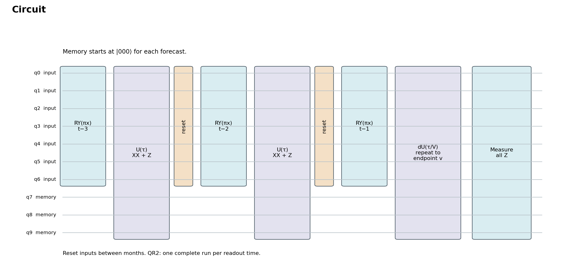

Seven inputs pass through three months of evolution with three memory qubits. Inputs reset between months. QR2 needs separate runs for its two readout times; backend support remains unverified.

[PDF](figures/20_circuit_protocol.pdf) · [Data 1](tables/example_three_month_inputs.csv) · [Data 2](tables/example_three_month_angles.csv) · [Data 3](tables/circuit_resources.csv)

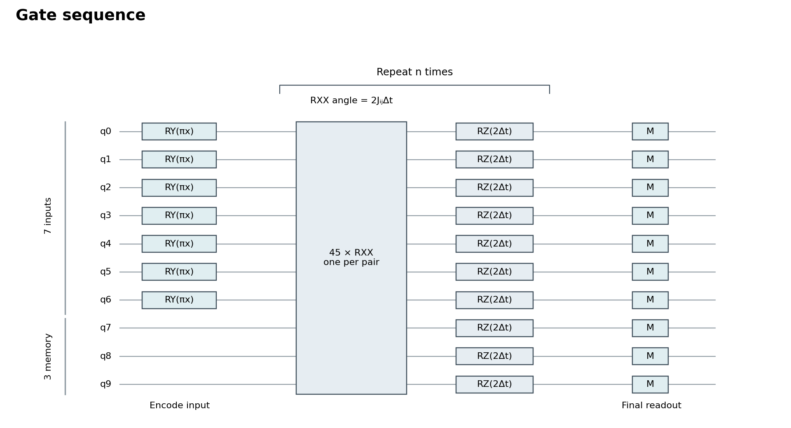

RY encodes each input. One Trotter step applies 45 pairwise RXX gates, then RZ on every qubit. Only this evolution block repeats; measurements occur at the final readout.

[PDF](figures/21_gate_sequence.pdf) · [Data](tables/gate_sequence.csv)

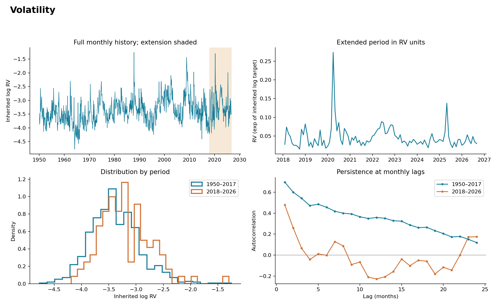

920 monthly observations. Volatility has sharp spikes and short-term persistence; the extended period has weaker autocorrelation at longer lags.

[PDF](figures/01_data_overview.pdf) · [Data 1](tables/rv_series.csv) · [Data 2](tables/rv_autocorrelation.csv)

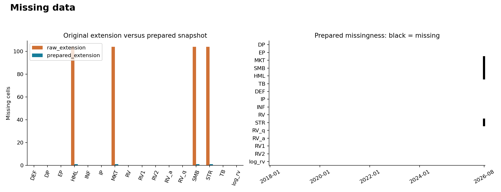

Preparation reduced missing values from 416 to 4. The remaining August factors prevent September forecasts that need those inputs.

[PDF](figures/02_missingness.pdf) · [Data](tables/missingness.csv)

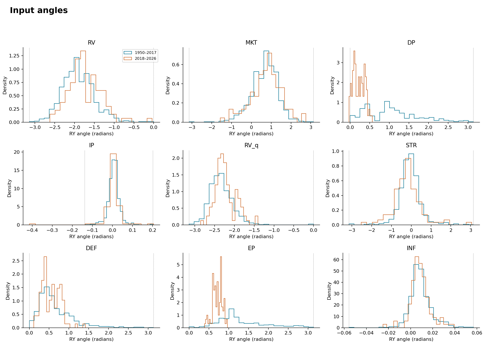

Each input becomes a rotation angle: π × value. Four DP values and two IP values exceed their historical ranges; inputs were not clipped.

[PDF](figures/03_encoding_ranges.pdf) · [Data 1](tables/encoding_ranges.csv) · [Data 2](tables/encoded_angles.csv)

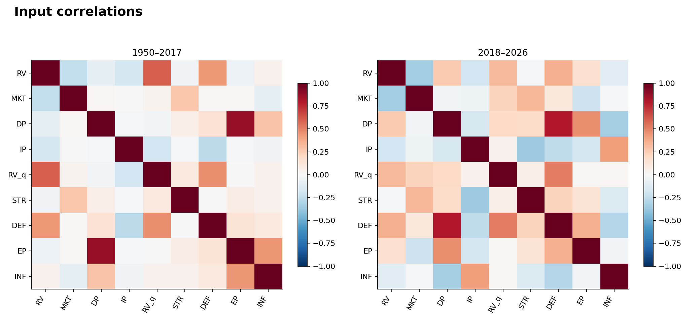

DP and EP are strongly correlated. Some relationships change in the extended period, so historical input relationships may not remain stable.

[PDF](figures/04_input_correlations.pdf) · [Data 1](tables/input_correlation_1950.csv) · [Data 2](tables/input_correlation_2018.csv)

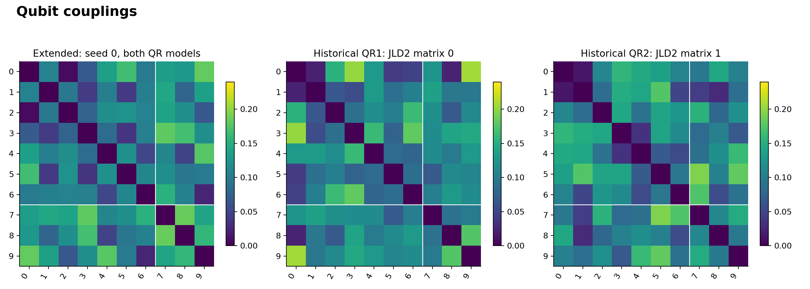

All 10 qubits interact: 45 pairs per Trotter step. White lines separate seven input qubits from three memory qubits.

[PDF](figures/05_couplings.pdf) · [Data 1](tables/extended_couplings_seed0.csv) · [Data 2](tables/historical_couplings_QR1.csv) · [Data 3](tables/historical_couplings_QR2.csv)

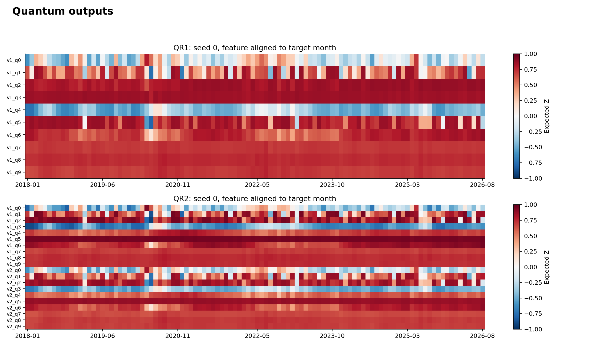

Each row is a qubit’s Z expectation at one readout time. Several channels change little across months, suggesting overlapping or weakly varying information.

[PDF](figures/06_feature_traces.pdf) · [Data 1](tables/QR1_features_seed0.csv) · [Data 2](tables/QR2_features_seed0.csv)

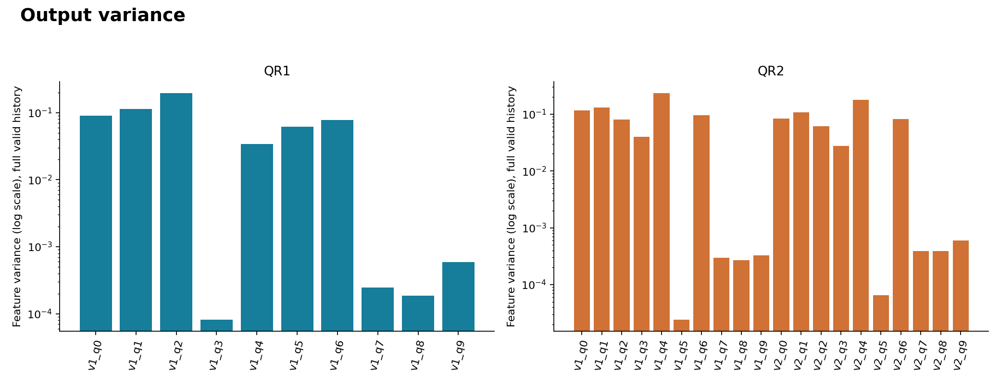

The least-variable channels have variances of 0.000081 (QR1) and 0.000024 (QR2). Small changes may be difficult to resolve with limited shots.

[PDF](figures/07_feature_variance.pdf) · [Data](tables/feature_variance.csv)

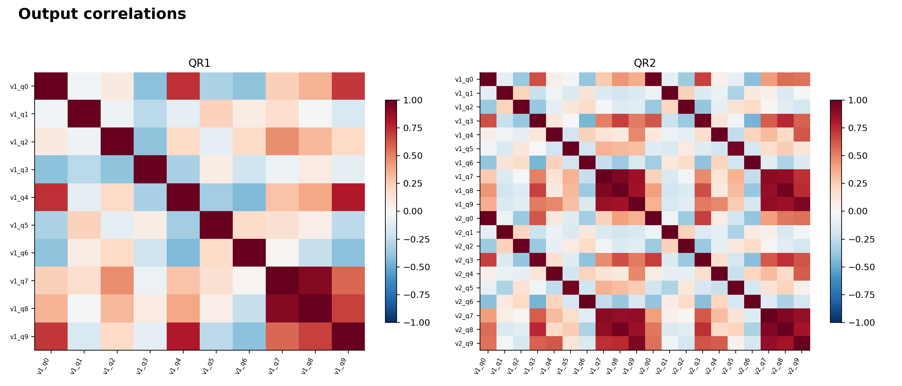

Several memory-qubit outputs are strongly correlated. This suggests redundancy, but removing outputs or qubits requires testing forecast accuracy.

[PDF](figures/08_feature_correlations.pdf) · [Data 1](tables/QR1_feature_correlation.csv) · [Data 2](tables/QR2_feature_correlation.csv)

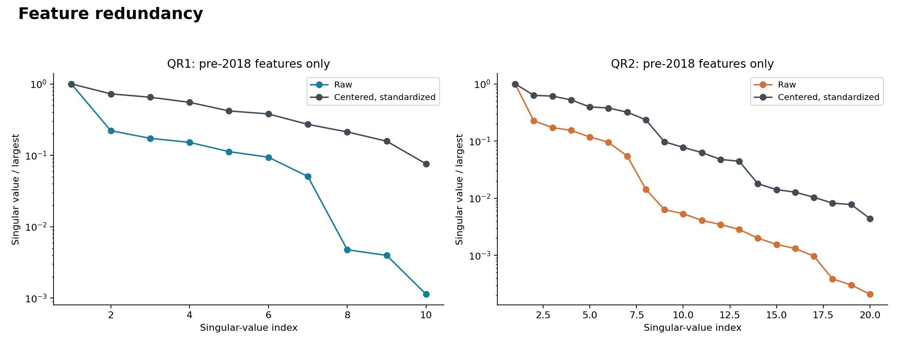

Small singular values indicate nearly overlapping feature directions. QR2 has more of these directions; extra outputs may add little independent information.

[PDF](figures/09_feature_spectra.pdf) · [Data](tables/feature_spectra.csv)

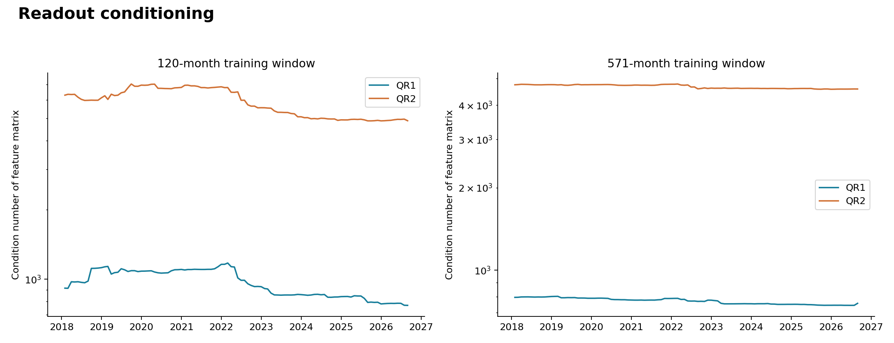

Higher values mean greater sensitivity to small input errors. Median condition numbers are about 967 vs 5,982 for QR1 vs QR2 at 120 months—roughly a sixfold difference.

[PDF](figures/10_conditioning.pdf) · [Data 1](tables/rolling_conditioning.csv) · [Data 2](tables/conditioning_summary.csv)

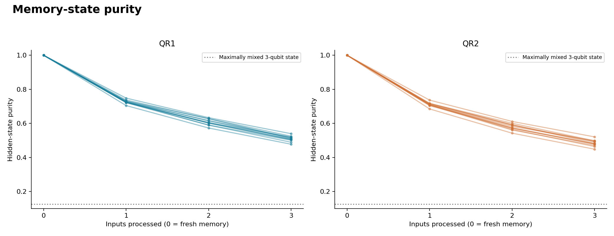

Across 12 histories, average purity falls from 1 to 0.509 (QR1) and 0.484 (QR2). Memory becomes mixed even without hardware noise; purity alone does not measure usefulness.

[PDF](figures/11_hidden_purity.pdf) · [Data 1](tables/hidden_states.csv) · [Data 2](tables/selected_histories.csv)

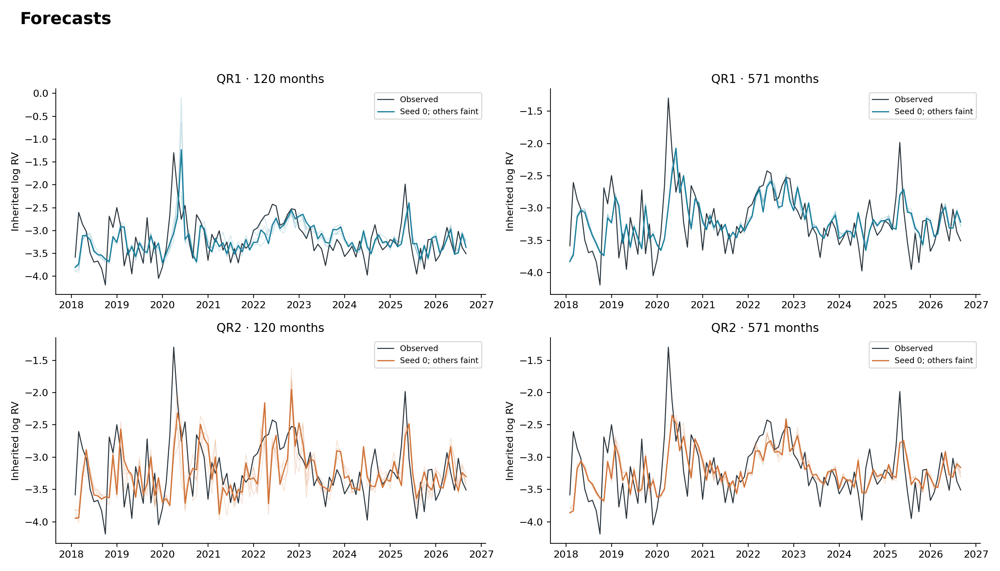

Black shows observed volatility; colored lines show five reservoir seeds. Both models miss some large spikes. Faint lines show seed variation, not confidence intervals.

[PDF](figures/12_forecasts.pdf) · [Data](tables/validated_predictions.csv)

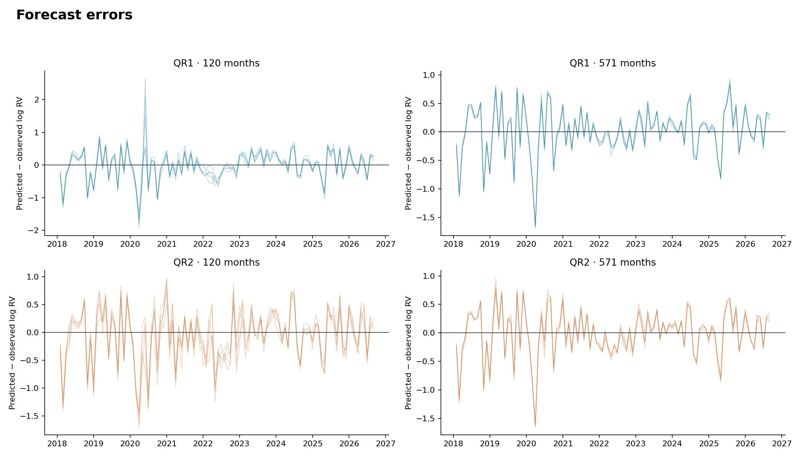

Error = predicted − observed log volatility. The largest errors cluster around the 2020 volatility shock; positive errors mean overprediction.

[PDF](figures/13_residual_timeline.pdf) · [Data](tables/validated_predictions.csv)

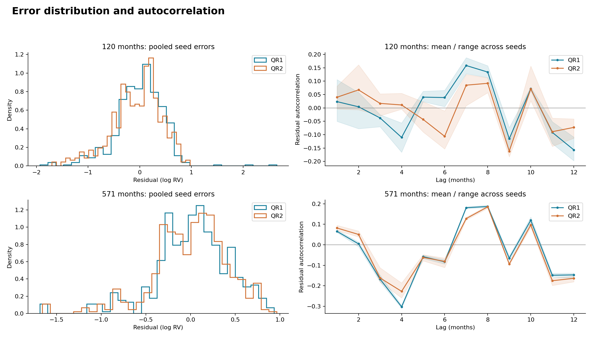

Errors have tails and some repeated lag patterns. Shading shows variation across seeds, not confidence intervals.

[PDF](figures/14_residual_distribution.pdf) · [Data 1](tables/validated_predictions.csv) · [Data 2](tables/residual_autocorrelation.csv)

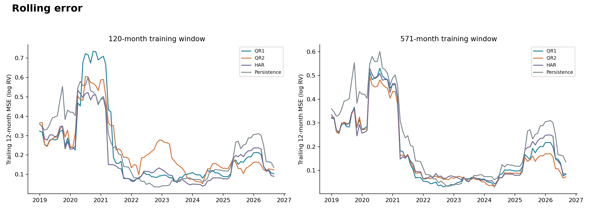

Trailing 12-month squared error peaks around 2020–2021. Model rankings change over time; neither quantum model consistently has the lowest error.

[PDF](figures/15_rolling_error.pdf) · [Data](tables/rolling_error.csv)

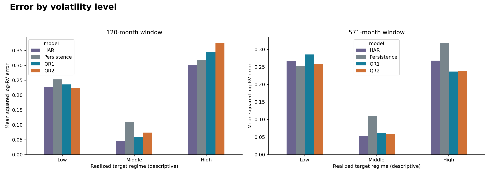

Errors are lowest in the middle-volatility group. Low and high volatility are harder to forecast; groups use historical thresholds and observed outcomes.

[PDF](figures/16_regime_errors.pdf) · [Data](tables/error_by_regime.csv)

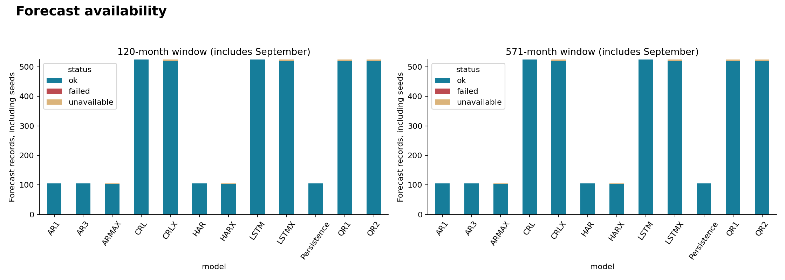

Two ARMAX fits failed and 44 records were unavailable. Counts include unscored September forecasts; models with five seeds have more records.

[PDF](figures/17_coverage.pdf) · [Data 1](tables/forecast_coverage.csv) · [Data 2](tables/validated_predictions.csv)

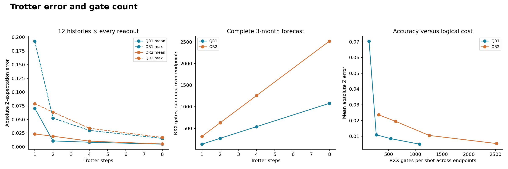

From 1 to 8 steps, mean Z error falls from 0.0704 to 0.0050 (QR1) and 0.0236 to 0.0054 (QR2), while gate counts rise eightfold. These are logical gates, not compiled IonQ counts.

[PDF](figures/18_accuracy_cost.pdf) · [Data 1](tables/trotter_error_summary.csv) · [Data 2](tables/circuit_resources.csv) · [Data 3](tables/circuit_total_cost.csv)

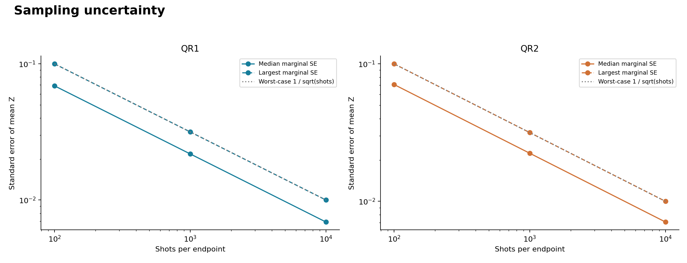

Worst-case Z standard error is 0.10, 0.032, and 0.01 at 100, 1,000, and 10,000 shots. This estimates sampling uncertainty only; it excludes hardware noise.

[PDF](figures/19_shot_uncertainty.pdf) · [Data 1](tables/shot_uncertainty.csv) · [Data 2](tables/shot_summary.csv)
