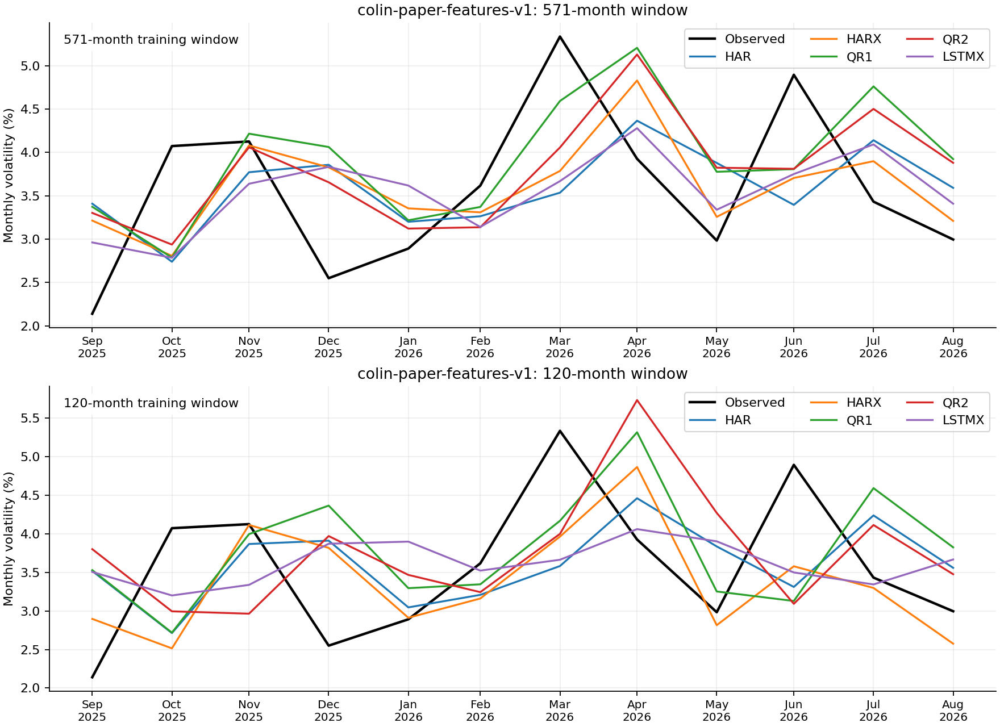
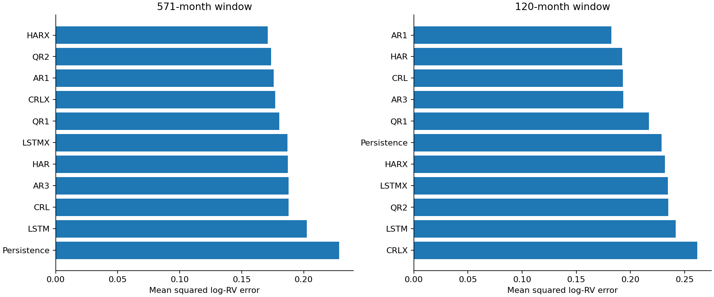

# Extended paper-feature results

Evaluation: 2018-01-31–2026-08-31. All 7560 expected records validated, including unscored forecasts.

Successful scored records: 7486. Failed or unavailable records: 46 (see failures.csv and coverage.csv).

## Forecast accuracy

Tables average losses across seeds; seeds are not independent market histories. Rankings below include only complete models. Incomplete models have separate common-date comparisons.

### post2017

| window | model | complete | successful_forecasts | mse_log_rv | rmse_log_rv | mae_log_rv | qlike_variance | mse_seed_std |
| --- | --- | --- | --- | --- | --- | --- | --- | --- |
| 120 | AR1 | True | 104 | 0.182363 | 0.427039 | 0.326285 | 0.726637 | 0 |
| 120 | HAR | True | 104 | 0.192469 | 0.438713 | 0.333343 | 0.821303 | 0 |
| 120 | CRL | True | 520 | 0.193199 | 0.439544 | 0.333965 | 0.798792 | 0.000108144 |
| 120 | AR3 | True | 104 | 0.193258 | 0.439611 | 0.333942 | 0.800543 | 0 |
| 120 | QR1 | True | 520 | 0.217209 | 0.466057 | 0.346422 | 0.733268 | 0.0217065 |
| 120 | Persistence | True | 104 | 0.228679 | 0.478204 | 0.378306 | 0.718969 | 0 |
| 120 | HARX | True | 104 | 0.231926 | 0.481587 | 0.353037 | 1.14915 | 0 |
| 120 | LSTMX | True | 520 | 0.234521 | 0.484273 | 0.369744 | 1.10255 | 0.00298681 |
| 120 | QR2 | True | 520 | 0.23498 | 0.484747 | 0.38095 | 0.850863 | 0.00651788 |
| 120 | LSTM | True | 520 | 0.241658 | 0.491587 | 0.366988 | 1.21301 | 0.00266608 |
| 120 | ARMAX | False | 103 | 0.251922 | 0.501919 | 0.380277 | 0.894432 | 0 |
| 120 | CRLX | True | 520 | 0.261788 | 0.511652 | 0.394237 | 1.11919 | 0.0211782 |
| 571 | HARX | True | 104 | 0.1711 | 0.413642 | 0.314295 | 0.614882 | 0 |
| 571 | QR2 | True | 520 | 0.173687 | 0.416758 | 0.319547 | 0.597621 | 0.00241228 |
| 571 | AR1 | True | 104 | 0.175719 | 0.419189 | 0.325137 | 0.591652 | 0 |
| 571 | CRLX | True | 520 | 0.177122 | 0.420858 | 0.324961 | 0.620176 | 0.00244937 |
| 571 | QR1 | True | 520 | 0.180212 | 0.424514 | 0.319969 | 0.613081 | 0.00280335 |
| 571 | LSTMX | True | 520 | 0.186869 | 0.432284 | 0.326677 | 0.667137 | 0.00156505 |
| 571 | HAR | True | 104 | 0.187131 | 0.432587 | 0.329462 | 0.726581 | 0 |
| 571 | AR3 | True | 104 | 0.187823 | 0.433385 | 0.330078 | 0.705373 | 0 |
| 571 | CRL | True | 520 | 0.187858 | 0.433425 | 0.329911 | 0.706457 | 7.64029e-05 |
| 571 | ARMAX | False | 103 | 0.197493 | 0.444402 | 0.333296 | 0.683733 | 0 |
| 571 | LSTM | True | 520 | 0.202595 | 0.450105 | 0.342587 | 0.821837 | 0.00346235 |
| 571 | Persistence | True | 104 | 0.228679 | 0.478204 | 0.378306 | 0.718969 | 0 |

571-month window: HARX has the lowest complete-model MSE (0.171100).

120-month window: AR1 has the lowest complete-model MSE (0.182363).

### last12

| window | model | complete | successful_forecasts | mse_log_rv | rmse_log_rv | mae_log_rv | qlike_variance | mse_seed_std |
| --- | --- | --- | --- | --- | --- | --- | --- | --- |
| 120 | HARX | True | 12 | 0.0638399 | 0.252666 | 0.20065 | 0.142306 | 0 |
| 120 | ARMAX | True | 12 | 0.0668821 | 0.258616 | 0.193714 | 0.124344 | 0 |
| 120 | LSTM | True | 60 | 0.0692441 | 0.263143 | 0.229289 | 0.138451 | 0.00255196 |
| 120 | LSTMX | True | 60 | 0.0821014 | 0.286533 | 0.244782 | 0.157004 | 0.00191445 |
| 120 | HAR | True | 12 | 0.0901862 | 0.30031 | 0.26002 | 0.185485 | 0 |
| 120 | AR3 | True | 12 | 0.0917743 | 0.302943 | 0.26974 | 0.187173 | 0 |
| 120 | AR1 | True | 12 | 0.0919353 | 0.303208 | 0.261594 | 0.18792 | 0 |
| 120 | CRL | True | 60 | 0.0919429 | 0.303221 | 0.270169 | 0.187302 | 0.000359242 |
| 120 | CRLX | True | 60 | 0.102563 | 0.320255 | 0.279985 | 0.228977 | 0.0145835 |
| 120 | QR1 | True | 60 | 0.104454 | 0.323193 | 0.27614 | 0.201024 | 0.00784134 |
| 120 | QR2 | True | 60 | 0.123361 | 0.351228 | 0.311651 | 0.23787 | 0.0229083 |
| 120 | Persistence | True | 12 | 0.135863 | 0.368595 | 0.324983 | 0.31363 | 0 |
| 571 | HARX | True | 12 | 0.0638506 | 0.252687 | 0.212257 | 0.129013 | 0 |
| 571 | LSTMX | True | 60 | 0.0670397 | 0.25892 | 0.228848 | 0.14056 | 0.00651088 |
| 571 | ARMAX | True | 12 | 0.072411 | 0.269093 | 0.234069 | 0.164862 | 0 |
| 571 | QR2 | True | 60 | 0.072715 | 0.269657 | 0.24394 | 0.135813 | 0.00648362 |
| 571 | CRLX | True | 60 | 0.0784115 | 0.28002 | 0.250251 | 0.166818 | 0.0126251 |
| 571 | QR1 | True | 60 | 0.0827546 | 0.287671 | 0.251812 | 0.14903 | 0.00423928 |
| 571 | HAR | True | 12 | 0.0855129 | 0.292426 | 0.257134 | 0.177243 | 0 |
| 571 | CRL | True | 60 | 0.087331 | 0.295518 | 0.268643 | 0.183821 | 0.000366531 |
| 571 | AR3 | True | 12 | 0.0876705 | 0.296092 | 0.269275 | 0.184303 | 0 |
| 571 | LSTM | True | 60 | 0.0889205 | 0.298195 | 0.268184 | 0.18831 | 0.0093051 |
| 571 | AR1 | True | 12 | 0.09766 | 0.312506 | 0.270245 | 0.19562 | 0 |
| 571 | Persistence | True | 12 | 0.135863 | 0.368595 | 0.324983 | 0.31363 | 0 |

571-month window: HARX has the lowest complete-model MSE (0.063851).

120-month window: HARX has the lowest complete-model MSE (0.063840).

## Statistical evidence

MCS uses 10,000 stationary-bootstrap replications, expected block length six months, seed 0 and familywise size 0.05. HAR loss-difference intervals use paired date resampling of seed-averaged losses. Unadjusted pairwise intervals do not establish familywise superiority. A p-value of one is not proof of a unique winner.

| model | mcs_pvalue | window | loss | scope | months |
| --- | --- | --- | --- | --- | --- |
| Persistence | 0.0117 | 571 | mse_log_rv | complete_period | 104 |
| LSTMX | 0.0422 | 571 | mse_log_rv | complete_period | 104 |
| LSTM | 0.1572 | 571 | mse_log_rv | complete_period | 104 |
| HAR | 0.4331 | 571 | mse_log_rv | complete_period | 104 |
| AR3 | 0.4891 | 571 | mse_log_rv | complete_period | 104 |
| CRL | 0.4891 | 571 | mse_log_rv | complete_period | 104 |
| CRLX | 0.8288 | 571 | mse_log_rv | complete_period | 104 |
| QR1 | 0.8288 | 571 | mse_log_rv | complete_period | 104 |
| AR1 | 0.904 | 571 | mse_log_rv | complete_period | 104 |
| QR2 | 0.904 | 571 | mse_log_rv | complete_period | 104 |
| HARX | 1 | 571 | mse_log_rv | complete_period | 104 |
| Persistence | 0.0161 | 571 | mse_log_rv | all_model_common_dates | 103 |
| LSTMX | 0.0481 | 571 | mse_log_rv | all_model_common_dates | 103 |
| ARMAX | 0.0609 | 571 | mse_log_rv | all_model_common_dates | 103 |
| LSTM | 0.159 | 571 | mse_log_rv | all_model_common_dates | 103 |
| HAR | 0.3923 | 571 | mse_log_rv | all_model_common_dates | 103 |
| AR3 | 0.4132 | 571 | mse_log_rv | all_model_common_dates | 103 |
| CRL | 0.4132 | 571 | mse_log_rv | all_model_common_dates | 103 |
| CRLX | 0.8309 | 571 | mse_log_rv | all_model_common_dates | 103 |
| QR1 | 0.8309 | 571 | mse_log_rv | all_model_common_dates | 103 |
| AR1 | 0.8524 | 571 | mse_log_rv | all_model_common_dates | 103 |
| QR2 | 0.8524 | 571 | mse_log_rv | all_model_common_dates | 103 |
| HARX | 1 | 571 | mse_log_rv | all_model_common_dates | 103 |
| LSTMX | 0.1243 | 571 | qlike_variance | complete_period | 104 |
| AR3 | 0.2996 | 571 | qlike_variance | complete_period | 104 |
| CRL | 0.3015 | 571 | qlike_variance | complete_period | 104 |
| HAR | 0.3457 | 571 | qlike_variance | complete_period | 104 |
| LSTM | 0.4232 | 571 | qlike_variance | complete_period | 104 |
| Persistence | 0.7065 | 571 | qlike_variance | complete_period | 104 |
| HARX | 0.8723 | 571 | qlike_variance | complete_period | 104 |
| CRLX | 0.8723 | 571 | qlike_variance | complete_period | 104 |
| QR1 | 0.8723 | 571 | qlike_variance | complete_period | 104 |
| QR2 | 0.9159 | 571 | qlike_variance | complete_period | 104 |
| AR1 | 1 | 571 | qlike_variance | complete_period | 104 |
| LSTMX | 0.1357 | 571 | qlike_variance | all_model_common_dates | 103 |
| AR3 | 0.3108 | 571 | qlike_variance | all_model_common_dates | 103 |
| CRL | 0.3155 | 571 | qlike_variance | all_model_common_dates | 103 |
| ARMAX | 0.3398 | 571 | qlike_variance | all_model_common_dates | 103 |
| HAR | 0.3398 | 571 | qlike_variance | all_model_common_dates | 103 |
| LSTM | 0.4331 | 571 | qlike_variance | all_model_common_dates | 103 |
| Persistence | 0.7343 | 571 | qlike_variance | all_model_common_dates | 103 |
| HARX | 0.8844 | 571 | qlike_variance | all_model_common_dates | 103 |
| CRLX | 0.8844 | 571 | qlike_variance | all_model_common_dates | 103 |
| QR1 | 0.8844 | 571 | qlike_variance | all_model_common_dates | 103 |
| QR2 | 0.9453 | 571 | qlike_variance | all_model_common_dates | 103 |
| AR1 | 1 | 571 | qlike_variance | all_model_common_dates | 103 |
| LSTMX | 0.1315 | 120 | mse_log_rv | complete_period | 104 |
| QR2 | 0.1491 | 120 | mse_log_rv | complete_period | 104 |
| LSTM | 0.1912 | 120 | mse_log_rv | complete_period | 104 |
| CRLX | 0.2057 | 120 | mse_log_rv | complete_period | 104 |
| Persistence | 0.2154 | 120 | mse_log_rv | complete_period | 104 |
| HARX | 0.5141 | 120 | mse_log_rv | complete_period | 104 |
| AR3 | 0.5695 | 120 | mse_log_rv | complete_period | 104 |
| CRL | 0.5695 | 120 | mse_log_rv | complete_period | 104 |
| HAR | 0.5695 | 120 | mse_log_rv | complete_period | 104 |
| QR1 | 0.5695 | 120 | mse_log_rv | complete_period | 104 |
| AR1 | 1 | 120 | mse_log_rv | complete_period | 104 |
| LSTMX | 0.0903 | 120 | mse_log_rv | all_model_common_dates | 103 |
| QR2 | 0.1823 | 120 | mse_log_rv | all_model_common_dates | 103 |
| LSTM | 0.2046 | 120 | mse_log_rv | all_model_common_dates | 103 |
| CRLX | 0.2046 | 120 | mse_log_rv | all_model_common_dates | 103 |
| Persistence | 0.2509 | 120 | mse_log_rv | all_model_common_dates | 103 |
| ARMAX | 0.4467 | 120 | mse_log_rv | all_model_common_dates | 103 |
| HARX | 0.5251 | 120 | mse_log_rv | all_model_common_dates | 103 |
| AR3 | 0.5402 | 120 | mse_log_rv | all_model_common_dates | 103 |
| CRL | 0.5402 | 120 | mse_log_rv | all_model_common_dates | 103 |
| HAR | 0.5402 | 120 | mse_log_rv | all_model_common_dates | 103 |
| QR1 | 0.5402 | 120 | mse_log_rv | all_model_common_dates | 103 |
| AR1 | 1 | 120 | mse_log_rv | all_model_common_dates | 103 |
| CRLX | 0.1775 | 120 | qlike_variance | complete_period | 104 |
| LSTMX | 0.2667 | 120 | qlike_variance | complete_period | 104 |
| LSTM | 0.4504 | 120 | qlike_variance | complete_period | 104 |
| AR3 | 0.5146 | 120 | qlike_variance | complete_period | 104 |
| CRL | 0.5192 | 120 | qlike_variance | complete_period | 104 |
| HARX | 0.5192 | 120 | qlike_variance | complete_period | 104 |
| HAR | 0.5849 | 120 | qlike_variance | complete_period | 104 |
| QR2 | 0.5849 | 120 | qlike_variance | complete_period | 104 |
| QR1 | 0.9933 | 120 | qlike_variance | complete_period | 104 |
| AR1 | 0.9933 | 120 | qlike_variance | complete_period | 104 |
| Persistence | 1 | 120 | qlike_variance | complete_period | 104 |
| CRLX | 0.1878 | 120 | qlike_variance | all_model_common_dates | 103 |
| LSTMX | 0.2945 | 120 | qlike_variance | all_model_common_dates | 103 |
| LSTM | 0.4931 | 120 | qlike_variance | all_model_common_dates | 103 |
| AR3 | 0.5549 | 120 | qlike_variance | all_model_common_dates | 103 |
| CRL | 0.562 | 120 | qlike_variance | all_model_common_dates | 103 |
| HARX | 0.562 | 120 | qlike_variance | all_model_common_dates | 103 |
| HAR | 0.6518 | 120 | qlike_variance | all_model_common_dates | 103 |
| QR2 | 0.6518 | 120 | qlike_variance | all_model_common_dates | 103 |
| ARMAX | 0.6518 | 120 | qlike_variance | all_model_common_dates | 103 |
| QR1 | 0.9942 | 120 | qlike_variance | all_model_common_dates | 103 |
| AR1 | 0.9942 | 120 | qlike_variance | all_model_common_dates | 103 |
| Persistence | 1 | 120 | qlike_variance | all_model_common_dates | 103 |

## Protocol and limitations

Paper-feature extension: original QR1/QR2 feature subsets, 11-input LSTMX/CRLX, ten macro predictors for HARX/ARMAX. DP/TB differences are fixed from historical conventions. HAR averages are formed causally. Normalized RV is inverted with inherited legacy constants. Quarterly/annual quantum inputs retain their verified historical transformations.

This is retrospective reconstruction: the source includes no construction code or scaling metadata; macro publication availability is unverified. FIZ factors through 2024 transition to CIZ in 2025. Missing August factors block dependent September forecasts. Statistical outliers remain in the primary sample. The target differs slightly from the independently rebuilt modern series, so cross-protocol losses are not pooled.

This run uses rolling windows [571, 120] and stochastic seeds [0, 1, 2, 3, 4]. The month following 2026-08-31 is unscored. Quantum results use ideal exact simulation, not hardware or trading returns. Numerical failures are retained without substituting forecasts. No window or model is selected for deployment using these results.

## Reproduce

`python run_study.py report --run results/extended-2026-09-24`

See manifest.json for identity, inputs, source hashes and environment. See RUN_ORDER.md and docs-dataset/AUDIT.md for preparation and source limitations.
