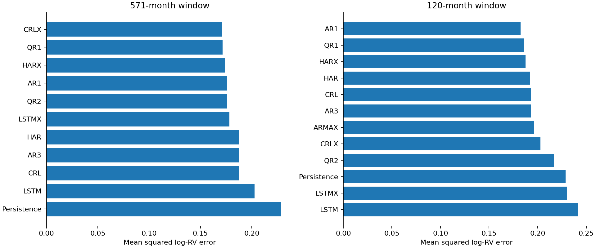

# modern-v1 results

Evaluation: 2018-01-31–2026-08-31. All 7560 expected records validated, including unscored forecasts.

Successful scored records: 7486. Failed or unavailable records: 2 (see failures.csv and coverage.csv).

## Forecast accuracy

Tables average losses across seeds; seeds are not independent market histories. Rankings below include only complete models. Incomplete models have separate common-date comparisons.

### post2017

| window | model | complete | successful_forecasts | mse_log_rv | rmse_log_rv | mae_log_rv | qlike_variance | mse_seed_std |
| --- | --- | --- | --- | --- | --- | --- | --- | --- |
| 120 | AR1 | True | 104 | 0.18236 | 0.427036 | 0.326282 | 0.72663 | 0 |
| 120 | QR1 | True | 520 | 0.18587 | 0.431127 | 0.33053 | 0.667172 | 0.00257926 |
| 120 | HARX | True | 104 | 0.187691 | 0.433233 | 0.328874 | 0.671819 | 0 |
| 120 | HAR | True | 104 | 0.192466 | 0.438709 | 0.33334 | 0.821286 | 0 |
| 120 | CRL | True | 520 | 0.193196 | 0.43954 | 0.333962 | 0.79878 | 0.000108096 |
| 120 | AR3 | True | 104 | 0.193255 | 0.439608 | 0.333939 | 0.800531 | 0 |
| 120 | ARMAX | True | 104 | 0.196522 | 0.443308 | 0.347109 | 0.65481 | 0 |
| 120 | CRLX | True | 520 | 0.202915 | 0.450461 | 0.348296 | 0.757332 | 0.00678295 |
| 120 | QR2 | True | 520 | 0.216499 | 0.465295 | 0.355652 | 0.766599 | 0.00426827 |
| 120 | Persistence | True | 104 | 0.228674 | 0.478199 | 0.378301 | 0.718946 | 0 |
| 120 | LSTMX | True | 520 | 0.230279 | 0.479874 | 0.356291 | 1.17468 | 0.0017752 |
| 120 | LSTM | True | 520 | 0.241656 | 0.491586 | 0.366987 | 1.21302 | 0.0026659 |
| 571 | CRLX | True | 520 | 0.170985 | 0.413503 | 0.319831 | 0.609408 | 0.001523 |
| 571 | QR1 | True | 520 | 0.171392 | 0.413995 | 0.316781 | 0.595298 | 0.000509451 |
| 571 | HARX | True | 104 | 0.173748 | 0.416831 | 0.316407 | 0.651397 | 0 |
| 571 | AR1 | True | 104 | 0.175715 | 0.419184 | 0.325133 | 0.591646 | 0 |
| 571 | QR2 | True | 520 | 0.17602 | 0.419547 | 0.320737 | 0.632227 | 0.00205254 |
| 571 | ARMAX | False | 102 | 0.177364 | 0.421146 | 0.325174 | 0.621384 | 0 |
| 571 | LSTMX | True | 520 | 0.178195 | 0.422132 | 0.320938 | 0.672357 | 0.00510516 |
| 571 | HAR | True | 104 | 0.187128 | 0.432583 | 0.329459 | 0.726565 | 0 |
| 571 | AR3 | True | 104 | 0.187819 | 0.433381 | 0.330074 | 0.705361 | 0 |
| 571 | CRL | True | 520 | 0.187854 | 0.433421 | 0.329907 | 0.706445 | 7.64126e-05 |
| 571 | LSTM | True | 520 | 0.202591 | 0.450101 | 0.342583 | 0.821823 | 0.0034622 |
| 571 | Persistence | True | 104 | 0.228674 | 0.478199 | 0.378301 | 0.718946 | 0 |

571-month window: CRLX has the lowest complete-model MSE (0.170985).

120-month window: AR1 has the lowest complete-model MSE (0.182360).

### last12

| window | model | complete | successful_forecasts | mse_log_rv | rmse_log_rv | mae_log_rv | qlike_variance | mse_seed_std |
| --- | --- | --- | --- | --- | --- | --- | --- | --- |
| 120 | LSTMX | True | 60 | 0.0676978 | 0.260188 | 0.22146 | 0.137647 | 0.00238802 |
| 120 | LSTM | True | 60 | 0.0692425 | 0.26314 | 0.229288 | 0.13845 | 0.00255252 |
| 120 | ARMAX | True | 12 | 0.0891341 | 0.298553 | 0.258405 | 0.201222 | 0 |
| 120 | HAR | True | 12 | 0.0901843 | 0.300307 | 0.260017 | 0.185482 | 0 |
| 120 | AR3 | True | 12 | 0.0917724 | 0.30294 | 0.269737 | 0.18717 | 0 |
| 120 | AR1 | True | 12 | 0.0919337 | 0.303206 | 0.261591 | 0.187918 | 0 |
| 120 | CRL | True | 60 | 0.091941 | 0.303218 | 0.270166 | 0.1873 | 0.000359381 |
| 120 | HARX | True | 12 | 0.0937944 | 0.306259 | 0.274559 | 0.2077 | 0 |
| 120 | QR1 | True | 60 | 0.103713 | 0.322045 | 0.285435 | 0.230462 | 0.00326719 |
| 120 | QR2 | True | 60 | 0.111472 | 0.333874 | 0.291007 | 0.261556 | 0.00657831 |
| 120 | CRLX | True | 60 | 0.116111 | 0.340751 | 0.299724 | 0.246606 | 0.00362449 |
| 120 | Persistence | True | 12 | 0.135859 | 0.368591 | 0.324979 | 0.313622 | 0 |
| 571 | HAR | True | 12 | 0.0855105 | 0.292422 | 0.25713 | 0.17724 | 0 |
| 571 | ARMAX | True | 12 | 0.0855635 | 0.292512 | 0.25723 | 0.18467 | 0 |
| 571 | HARX | True | 12 | 0.0867294 | 0.294499 | 0.268247 | 0.186679 | 0 |
| 571 | CRL | True | 60 | 0.0873286 | 0.295514 | 0.268639 | 0.183818 | 0.000366397 |
| 571 | AR3 | True | 12 | 0.087668 | 0.296088 | 0.26927 | 0.1843 | 0 |
| 571 | QR2 | True | 60 | 0.0889074 | 0.298174 | 0.271903 | 0.191935 | 0.00255742 |
| 571 | LSTM | True | 60 | 0.088918 | 0.298191 | 0.26818 | 0.188307 | 0.00930484 |
| 571 | LSTMX | True | 60 | 0.0914166 | 0.302352 | 0.265142 | 0.19744 | 0.00632756 |
| 571 | QR1 | True | 60 | 0.0942386 | 0.306983 | 0.278724 | 0.206549 | 0.00227139 |
| 571 | AR1 | True | 12 | 0.0976567 | 0.312501 | 0.27024 | 0.195617 | 0 |
| 571 | CRLX | True | 60 | 0.100462 | 0.316957 | 0.288162 | 0.212758 | 0.00533795 |
| 571 | Persistence | True | 12 | 0.135859 | 0.368591 | 0.324979 | 0.313622 | 0 |

571-month window: HAR has the lowest complete-model MSE (0.085511).

120-month window: LSTMX has the lowest complete-model MSE (0.067698).

## Statistical evidence

MCS uses 10,000 stationary-bootstrap replications, expected block length six months, seed 0 and familywise size 0.05. HAR loss-difference intervals use paired date resampling of seed-averaged losses. Unadjusted pairwise intervals do not establish familywise superiority. A p-value of one is not proof of a unique winner.

| model | mcs_pvalue | window | loss | scope | months |
| --- | --- | --- | --- | --- | --- |
| Persistence | 0.0109 | 571 | mse_log_rv | complete_period | 104 |
| LSTM | 0.1255 | 571 | mse_log_rv | complete_period | 104 |
| HAR | 0.3614 | 571 | mse_log_rv | complete_period | 104 |
| AR3 | 0.4817 | 571 | mse_log_rv | complete_period | 104 |
| CRL | 0.4817 | 571 | mse_log_rv | complete_period | 104 |
| QR2 | 0.6837 | 571 | mse_log_rv | complete_period | 104 |
| LSTMX | 0.6837 | 571 | mse_log_rv | complete_period | 104 |
| HARX | 0.9421 | 571 | mse_log_rv | complete_period | 104 |
| AR1 | 0.9421 | 571 | mse_log_rv | complete_period | 104 |
| QR1 | 0.9421 | 571 | mse_log_rv | complete_period | 104 |
| CRLX | 1 | 571 | mse_log_rv | complete_period | 104 |
| Persistence | 0.0161 | 571 | mse_log_rv | all_model_common_dates | 102 |
| LSTM | 0.1269 | 571 | mse_log_rv | all_model_common_dates | 102 |
| HAR | 0.3132 | 571 | mse_log_rv | all_model_common_dates | 102 |
| AR3 | 0.4724 | 571 | mse_log_rv | all_model_common_dates | 102 |
| CRL | 0.4724 | 571 | mse_log_rv | all_model_common_dates | 102 |
| ARMAX | 0.6106 | 571 | mse_log_rv | all_model_common_dates | 102 |
| QR2 | 0.6106 | 571 | mse_log_rv | all_model_common_dates | 102 |
| LSTMX | 0.6106 | 571 | mse_log_rv | all_model_common_dates | 102 |
| HARX | 0.8977 | 571 | mse_log_rv | all_model_common_dates | 102 |
| AR1 | 0.8977 | 571 | mse_log_rv | all_model_common_dates | 102 |
| QR1 | 0.9929 | 571 | mse_log_rv | all_model_common_dates | 102 |
| CRLX | 1 | 571 | mse_log_rv | all_model_common_dates | 102 |
| LSTM | 0.6327 | 571 | qlike_variance | complete_period | 104 |
| LSTMX | 0.6937 | 571 | qlike_variance | complete_period | 104 |
| AR3 | 0.7199 | 571 | qlike_variance | complete_period | 104 |
| Persistence | 0.7199 | 571 | qlike_variance | complete_period | 104 |
| CRL | 0.7199 | 571 | qlike_variance | complete_period | 104 |
| HAR | 0.7199 | 571 | qlike_variance | complete_period | 104 |
| QR2 | 0.7199 | 571 | qlike_variance | complete_period | 104 |
| HARX | 0.7199 | 571 | qlike_variance | complete_period | 104 |
| CRLX | 0.7199 | 571 | qlike_variance | complete_period | 104 |
| QR1 | 0.9423 | 571 | qlike_variance | complete_period | 104 |
| AR1 | 1 | 571 | qlike_variance | complete_period | 104 |
| ARMAX | 0.6828 | 571 | qlike_variance | all_model_common_dates | 102 |
| LSTM | 0.6828 | 571 | qlike_variance | all_model_common_dates | 102 |
| LSTMX | 0.6828 | 571 | qlike_variance | all_model_common_dates | 102 |
| AR3 | 0.7263 | 571 | qlike_variance | all_model_common_dates | 102 |
| CRL | 0.7263 | 571 | qlike_variance | all_model_common_dates | 102 |
| HAR | 0.7263 | 571 | qlike_variance | all_model_common_dates | 102 |
| Persistence | 0.7263 | 571 | qlike_variance | all_model_common_dates | 102 |
| QR2 | 0.7263 | 571 | qlike_variance | all_model_common_dates | 102 |
| HARX | 0.7263 | 571 | qlike_variance | all_model_common_dates | 102 |
| CRLX | 0.7263 | 571 | qlike_variance | all_model_common_dates | 102 |
| QR1 | 0.9954 | 571 | qlike_variance | all_model_common_dates | 102 |
| AR1 | 1 | 571 | qlike_variance | all_model_common_dates | 102 |
| QR2 | 0.1503 | 120 | mse_log_rv | complete_period | 104 |
| CRLX | 0.1503 | 120 | mse_log_rv | complete_period | 104 |
| LSTM | 0.1944 | 120 | mse_log_rv | complete_period | 104 |
| Persistence | 0.2824 | 120 | mse_log_rv | complete_period | 104 |
| LSTMX | 0.2824 | 120 | mse_log_rv | complete_period | 104 |
| AR3 | 0.7634 | 120 | mse_log_rv | complete_period | 104 |
| CRL | 0.7634 | 120 | mse_log_rv | complete_period | 104 |
| HAR | 0.7634 | 120 | mse_log_rv | complete_period | 104 |
| ARMAX | 0.7634 | 120 | mse_log_rv | complete_period | 104 |
| HARX | 0.9187 | 120 | mse_log_rv | complete_period | 104 |
| QR1 | 0.9187 | 120 | mse_log_rv | complete_period | 104 |
| AR1 | 1 | 120 | mse_log_rv | complete_period | 104 |
| QR2 | 0.1503 | 120 | mse_log_rv | all_model_common_dates | 104 |
| CRLX | 0.1503 | 120 | mse_log_rv | all_model_common_dates | 104 |
| LSTM | 0.1944 | 120 | mse_log_rv | all_model_common_dates | 104 |
| Persistence | 0.2824 | 120 | mse_log_rv | all_model_common_dates | 104 |
| LSTMX | 0.2824 | 120 | mse_log_rv | all_model_common_dates | 104 |
| AR3 | 0.7634 | 120 | mse_log_rv | all_model_common_dates | 104 |
| CRL | 0.7634 | 120 | mse_log_rv | all_model_common_dates | 104 |
| HAR | 0.7634 | 120 | mse_log_rv | all_model_common_dates | 104 |
| ARMAX | 0.7634 | 120 | mse_log_rv | all_model_common_dates | 104 |
| HARX | 0.9187 | 120 | mse_log_rv | all_model_common_dates | 104 |
| QR1 | 0.9187 | 120 | mse_log_rv | all_model_common_dates | 104 |
| AR1 | 1 | 120 | mse_log_rv | all_model_common_dates | 104 |
| QR2 | 0.1043 | 120 | qlike_variance | complete_period | 104 |
| CRLX | 0.1249 | 120 | qlike_variance | complete_period | 104 |
| LSTMX | 0.366 | 120 | qlike_variance | complete_period | 104 |
| LSTM | 0.3981 | 120 | qlike_variance | complete_period | 104 |
| AR3 | 0.4958 | 120 | qlike_variance | complete_period | 104 |
| CRL | 0.4971 | 120 | qlike_variance | complete_period | 104 |
| HAR | 0.5952 | 120 | qlike_variance | complete_period | 104 |
| Persistence | 0.9586 | 120 | qlike_variance | complete_period | 104 |
| AR1 | 0.9586 | 120 | qlike_variance | complete_period | 104 |
| QR1 | 0.9586 | 120 | qlike_variance | complete_period | 104 |
| HARX | 0.9586 | 120 | qlike_variance | complete_period | 104 |
| ARMAX | 1 | 120 | qlike_variance | complete_period | 104 |
| QR2 | 0.1043 | 120 | qlike_variance | all_model_common_dates | 104 |
| CRLX | 0.1249 | 120 | qlike_variance | all_model_common_dates | 104 |
| LSTMX | 0.366 | 120 | qlike_variance | all_model_common_dates | 104 |
| LSTM | 0.3981 | 120 | qlike_variance | all_model_common_dates | 104 |
| AR3 | 0.4958 | 120 | qlike_variance | all_model_common_dates | 104 |
| CRL | 0.4971 | 120 | qlike_variance | all_model_common_dates | 104 |
| HAR | 0.5952 | 120 | qlike_variance | all_model_common_dates | 104 |
| Persistence | 0.9586 | 120 | qlike_variance | all_model_common_dates | 104 |
| AR1 | 0.9586 | 120 | qlike_variance | all_model_common_dates | 104 |
| QR1 | 0.9586 | 120 | qlike_variance | all_model_common_dates | 104 |
| HARX | 0.9586 | 120 | qlike_variance | all_model_common_dates | 104 |
| ARMAX | 1 | 120 | qlike_variance | all_model_common_dates | 104 |

## Protocol and limitations

Modern price-feature extension: seven causal price-derived inputs; scaling calibrated through 2017 and frozen, input clipping retained and targets never clipped. QR1/QR2 share inputs. This is a separate retrospective price-derived benchmark, not the paper macro feature specification. Raw daily snapshot hashes are verified before training.

This run uses rolling windows [571, 120] and stochastic seeds [0, 1, 2, 3, 4]. The month following 2026-08-31 is unscored. Quantum results use ideal exact simulation, not hardware or trading returns. Numerical failures are retained without substituting forecasts. No window or model is selected for deployment using these results.

## Reproduce

`python run_study.py report --run results/modern-2026-09-24`

See manifest.json for identity, inputs, source hashes and environment. See RUN_ORDER.md and docs-colin/AUDIT.md for preparation and source limitations.
